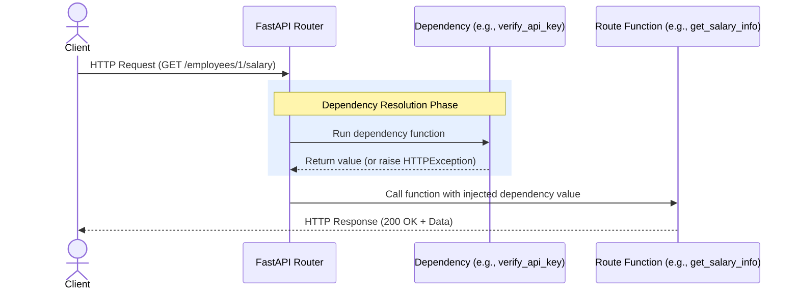

**Dependency Injection** is a software design pattern where an object or function receives other objects or services it depends on, rather than creating them internally. FastAPI has a extremely powerful, built-in Dependency Injection system that is simple to use and simplifies tasks like database connections, security, and authentication.

---

## 1. How Dependency Injection Works

When a request arrives, FastAPI inspects your route parameters. If it spots a parameter using `Depends(dependency_function)`, it executes that dependency first, gets its return value, and passes (injects) that value directly into your route function.



---

## 2. Defining and Using a Simple Dependency

Let's look at a common scenario: extracting and validating common query parameters (like pagination limits) for listing employees.

```python
from fastapi import FastAPI, Depends

app = FastAPI()

# 1. Define the dependency function
def get_pagination_params(skip: int = 0, limit: int = 10):
    return {"skip": skip, "limit": limit}

# 2. Inject it using Depends()
@app.get("/employees")
def list_employees(pagination: dict = Depends(get_pagination_params)):
    # pagination contains {"skip": 0, "limit": 10} by default
    return {
        "message": "List of employees",
        "applied_pagination": pagination
    }
```

### Advantages:
* **Reusability**: You can reuse `Depends(get_pagination_params)` on any list route (e.g., `/departments`, `/chats`) across your app.
* **Auto-Documentation**: Query parameters defined inside the dependency (`skip` and `limit`) are automatically documented in Swagger UI!

---

## 3. Sub-dependencies (Hierarchical Dependencies)

Dependencies can depend on other dependencies. This allows you to build complex trees of validation logic easily.

### Example: Requiring a Validated Admin Header
Let's define a dependency that extracts the API key, and another dependency that verifies the key belongs to an Administrator:

```python
from fastapi import Header, HTTPException, status, Depends

# Dependency 1: Extract API Key
def get_api_key(x_api_key: str | None = Header(None)):
    if not x_api_key:
        raise HTTPException(
            status_code=status.HTTP_401_UNAUTHORIZED, 
            detail="Missing API Key header"
        )
    return x_api_key

# Dependency 2: Verify Key belongs to Admin (Depends on Dependency 1)
def verify_admin_key(api_key: str = Depends(get_api_key)):
    if api_key != "secret-admin-key":
        raise HTTPException(
            status_code=status.HTTP_403_FORBIDDEN, 
            detail="Forbidden: Admin privileges required"
        )
    return "Admin-User"

# Use in Endpoint
@app.delete("/employees/{emp_id}")
def delete_employee(emp_id: int, admin_user: str = Depends(verify_admin_key)):
    # This route only executes if both dependencies pass
    return {"message": f"Employee {emp_id} deleted successfully by {admin_user}"}
```

---

## 4. Key Use Cases for Dependency Injection in FastAPI

As our Employee Management System grows, we will use Dependency Injection for:
1. **Database Session Lifetime Management**: Opening a database session before a query, injecting it, and automatically closing it after the request completes.
2. **Security & Authentication**: Validating JWT tokens and fetching the details of the currently logged-in user.
3. **Role Validation**: Ensuring the current user has the correct authorization scope (`Admin`, `Manager`, or `Employee`).
