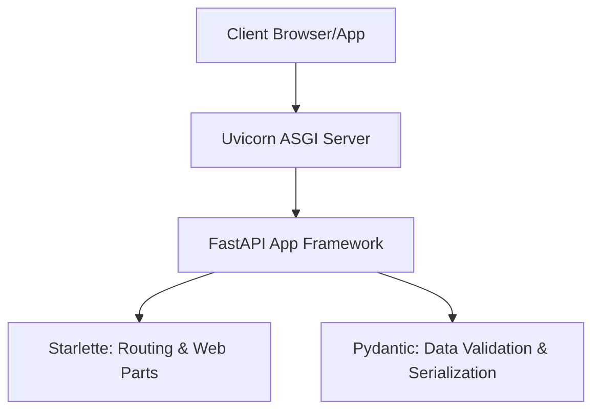

##  What is FastAPI?

FastAPI is a modern, high-performance Python web framework for building APIs. 

It is built on top of **Starlette** and **Pydantic**, leveraging Python's type hints to provide automatic request validation, interactive API documentation, and excellent developer productivity.

Before learning FastAPI, it's important to understand **what an API is**, **why it exists**, and **how applications communicate over the web**.

## What is an API?

**API** stands for **Application Programming Interface**.

An API is a set of rules that allows two software applications to communicate with each other. It acts as an intermediary between a **client** and a **server**, enabling them to exchange data and perform operations without exposing the internal implementation of either system.

Every time you:

- Log in to a website
- Search for products on an e-commerce site
- Check the weather on your phone
- Book a cab
- Make an online payment

your application is communicating with one or more APIs.


## Why Do We Need APIs?

Modern applications are made up of multiple independent components. APIs provide a standardized way for these components to communicate.

APIs are commonly used to:

- Connect frontend applications to backend services.
- Exchange data between different systems.
- Integrate third-party services such as payment gateways and maps.
- Build mobile and web applications using the same backend.
- Develop scalable microservices.
- Serve AI and Machine Learning models.

Without APIs, every application would need direct access to another application's internal code or database, making systems difficult to maintain and scale.


FastAPI is used to build the **server-side** of this communication.

## Why FastAPI?

FastAPI simplifies backend development by providing:

* **🚀 High Performance**: Built on top of Starlette and Pydantic, making it one of the fastest Python frameworks available, on par with Node.js and Go.
* **✍️ Faster Coding**: Speeds up feature development by 200% to 300%.
* **🛡️ Fewer Bugs**: Reduces developer-induced errors by about 40% through automatic validation.
* **📖 Auto-Generated Documentation**: Generates interactive documentation pages (Swagger UI and ReDoc) automatically.
* **🔒 Modern & Async**: Native support for asynchronous programming (`async/await`) out of the box.


## The Tech Stack Under the Hood

FastAPI stands on the shoulders of giants:



* **Uvicorn**: An ASGI (Asynchronous Server Gateway Interface) web server implementation for Python. It acts as the web server that receives incoming TCP connections from clients and forwards them to FastAPI.
* **Starlette**: A lightweight ASGI framework toolkit. FastAPI inherits all its routing and web handling capabilities from Starlette.
* **Pydantic**: The data validation and serialization library. It enforces types and formats data.

## FastAPI Architecture

FastAPI is **not built from scratch**. It combines the strengths of **Python**, **Starlette**, and **Pydantic**, while adding its own API-specific features.

```text
                Your Application
                       │
                  FastAPI
        ┌──────────────┴──────────────┐
        │                             │
    Starlette                     Pydantic
 (Web Framework)             (Data Validation)
        │                             │
        └──────────────┬──────────────┘
                       │
                  Uvicorn (ASGI)
```


### Python Language Features

FastAPI relies heavily on Python's language features.

- Functions
- Classes & Objects
- Type Hints
- Function Parameters
- Default Arguments
- Async/Await
- Decorators
- Generators (`yield`)
- Context Managers
- Exceptions
- Modules & Packages

Example:

```python
@app.get("/users")
def get_users(limit: int = 10):
    ...
```

Python provides:

- Function definition
- Decorator syntax
- Type hints
- Default arguments
- Async programming support

### Starlette Responsibilities (Web Layer)

Starlette provides the web framework capabilities.

- ASGI application
- Routing
- Request object
- Response classes
- Middleware
- Exception handling
- WebSockets
- Background Tasks
- Static Files
- Template rendering
- Lifespan events (startup/shutdown)

Common classes:

```python
Request
JSONResponse
HTMLResponse
FileResponse
StreamingResponse
StaticFiles
WebSocket
```

Think of Starlette as the **Web Framework** that handles everything related to HTTP communication.

### Pydantic Responsibilities (Data Layer)

Pydantic handles data validation and serialization.

- Data Models (`BaseModel`)
- Request Body Validation
- Type Conversion
- Serialization (`model_dump()`)
- Deserialization
- Field Validation
- JSON Schema Generation
- Settings Management (`BaseSettings`)

Example:

```python
class User(BaseModel):
    name: str
    age: int
```

Pydantic automatically:

- Validates input data
- Converts compatible types
- Generates validation errors
- Serializes responses
- Generates schemas for API documentation

Think of Pydantic as the **Data Validation Framework**.

### FastAPI Responsibilities

FastAPI binds Starlette and Pydantic together and adds API-specific features.

#### Request Handling

- Path Parameters
- Query Parameters
- Headers
- Cookies
- Request Body Parsing

#### Dependency Injection

- `Depends()`
- Automatic dependency resolution
- Dependency cleanup using `yield`

#### Response Handling

- Response Models
- Automatic serialization
- Status code handling

#### API Documentation

- OpenAPI generation
- Swagger UI
- ReDoc

#### Security

- OAuth2 helpers
- JWT integration helpers
- API Key support
- Security dependencies

#### Routing Enhancements

- APIRouter
- Tags
- Prefixes
- API versioning support

### Responsibility Summary

| Component | Responsibility |
|-----------|----------------|
| Python | Language features (functions, classes, decorators, async, type hints, etc.) |
| Starlette | Web framework (HTTP, routing, middleware, requests, responses, WebSockets) |
| Pydantic | Data validation, serialization, data models, settings |
| FastAPI | API framework that binds Starlette and Pydantic together while adding dependency injection, parameter handling, security, response models, and automatic API documentation |

### How They Work Together

```text
HTTP Request
      │
      ▼
Uvicorn
      │
      ▼
Starlette
(Routing, Request, Middleware)
      │
      ▼
FastAPI
(Parameter Parsing, DI, API Logic)
      │
      ▼
Pydantic
(Validate & Convert Data)
      │
      ▼
Your Endpoint
      │
      ▼
Pydantic
(Serialize Response)
      │
      ▼
Starlette
(Create HTTP Response)
      │
      ▼
Client
```

### Summary

| Component | Think of it as |
|-----------|----------------|
| Python | Programming Language |
| Starlette | Web Framework |
| Pydantic | Data Validation Framework |
| FastAPI | API Framework that integrates Starlette and Pydantic into a complete REST API framework |

## Learning Objectives in this chapter..

After completing this chapter, you will be able to:

- Install and configure FastAPI
- Create and run your first API
- Understand routing and HTTP methods
- Work with path and query parameters
- Accept request data using Pydantic models
- Return structured responses
- Validate request data
- Use HTTP status codes
- Explore the generated API documentation

## Prerequisites

- Python 3.10 or later
- pip or uv
- Virtual Environment (recommended)
- VS Code or any Python IDE

## Creating a Virtual Environment

```bash
python -m venv .venv
```

Activate the environment.

**Windows**

```bash
.venv\Scripts\activate
```

**macOS / Linux**

```bash
source .venv/bin/activate
```

## Installing FastAPI

```bash
pip install fastapi
pip install "uvicorn[standard]"
```

Verify the installation.

```bash
pip show fastapi
pip show uvicorn
```

## Your First FastAPI Application

Create a file named **`main.py`**.

```python
from fastapi import FastAPI

app = FastAPI()

@app.get("/")
def home():
    return {"message": "Welcome to FastAPI"}
```
## Understanding the First FastAPI Program
Unlike traditional Python programs, a FastAPI application is **not a program that runs from top to bottom and immediately produces an output**.

Instead, we **configure** the FastAPI server by telling it:

- What application to create
- Which URLs it should respond to
- Which function should execute for each URL

When a client (such as a browser or Postman) sends a request, the FastAPI server uses this configuration to determine which function to execute.

### Key Points

#### 1. Import the FastAPI Class

```python
from fastapi import FastAPI
```

Imports the **FastAPI** class, which is used to create a FastAPI application.


#### 2. Create the Application

```python
app = FastAPI()
```

Creates the FastAPI application object.

The `app` object stores:

- API endpoints
- Application configuration
- Middleware
- Dependencies
- API documentation

> **Note:** This does **not** start the server. It only creates and configures the application.


#### 3. Register an Endpoint

```python
@app.get("/")
```

Registers a **GET** endpoint for the root URL (`/`).

It tells FastAPI:

> "If a GET request is received for `/`, execute the function below."


#### 4. Define the Request Handler

```python
def home():
```

This is a normal Python function.

Unlike traditional Python programs, **you do not call this function yourself**. FastAPI automatically calls it when a matching request arrives.


#### 5. Return the Response

```python
return {"message": "Welcome to FastAPI"}
```

Returns a Python dictionary.

FastAPI automatically converts it into a JSON response.

Client receives:

```json
{
    "message": "Welcome to FastAPI"
}
```


#### 6. JSON is the Default Response Format

FastAPI automatically converts Python objects such as:

- Dictionaries
- Lists
- Pydantic models

into **JSON** before sending them to the client.

You do **not** need to manually convert them into JSON.


## Traditional Python vs FastAPI

### Traditional Python

- Program executes from top to bottom.
- Functions are called explicitly by the programmer.
- Program ends after execution.

```python
def greet():
    print("Hello")

greet()
```


### FastAPI

- You configure the application.
- Register API endpoints.
- Start the server.
- FastAPI waits for incoming requests.
- FastAPI automatically calls the appropriate function when a request arrives.


## Execution Flow

```text
Start Application
        │
        ▼
Create FastAPI App
        │
        ▼
Register Endpoints
        │
        ▼
Start FastAPI Server
        │
        ▼
Wait for Client Requests
        │
        ▼
Request Received
        │
        ▼
Find Matching Endpoint
        │
        ▼
Execute Function
        │
        ▼
Convert Response to JSON
        │
        ▼
Send Response to Client
```

## Key Takeaways

- `FastAPI()` creates the web application.
- `@app.get("/")` registers an endpoint.
- Functions are executed **automatically** by FastAPI.
- Most FastAPI code is **configuration**, not direct execution.
- By default, FastAPI returns responses in **JSON** format.
- FastAPI handles request routing and response generation automatically.

## Running the Application

```bash
uvicorn main:app --reload
```

Common options:

```bash
uvicorn main:app --reload --host 0.0.0.0 --port 8000
```

**Command Breakdown**

- `main` → Python file (`main.py`)
- `app` → FastAPI application object
- `--reload` → Restart server on code changes
- `--host` → Host address
- `--port` → Server port

## Accessing the Application

| URL | Purpose |
|------|---------|
| `http://127.0.0.1:8000` | Application |
| `http://127.0.0.1:8000/docs` | Swagger UI |
| `http://127.0.0.1:8000/redoc` | ReDoc |
| `http://127.0.0.1:8000/openapi.json` | OpenAPI Specification |

---
title: "FastAPI CLI vs Uvicorn"
description: "Understand the difference between `fastapi dev main.py` and `uvicorn main:app`, when to use each, and why Uvicorn is preferred for production."
---

## Overview

Both commands start a FastAPI application, but they serve different purposes.

- **`fastapi dev main.py`** is a **development command** provided by the FastAPI CLI.
- **`uvicorn main:app`** directly starts the **Uvicorn ASGI server** and is suitable for both development and production.

## Comparison

| Feature | `fastapi dev main.py` | `uvicorn main:app` |
| --- | --- | --- |
| Tool | FastAPI CLI | Uvicorn ASGI Server |
| Primary Use | Development | Development & Production |
| Auto Reload | ✅ Enabled by default | ❌ Disabled (use `--reload`) |
| App Detection | Automatically discovers the app | App must be specified (`module:app`) |
| Configuration | Minimal | Highly configurable |
| Production Ready | ❌ No | ✅ Yes |

## `fastapi dev main.py`

Starts your application using the FastAPI CLI.

```bash
fastapi dev main.py
```

### Features

- Automatically finds the `FastAPI()` application.
- Enables auto reload by default.
- Displays helpful startup information.
- Designed for local development.

## `uvicorn main:app`

Starts the Uvicorn ASGI server directly.

```bash
uvicorn main:app
```

Where:

- `main` → Python module (`main.py`)
- `app` → FastAPI application instance

## Development Mode

To enable auto reload with Uvicorn:

```bash
uvicorn main:app --reload
```

Without `--reload`, code changes require restarting the server manually.

## Production

For production deployments:

```bash
uvicorn main:app --host 0.0.0.0 --port 8000
```

`fastapi dev` should **not** be used in production because it is intended only for development.

## Execution Flow

```text
fastapi dev main.py
        │
        ▼
    FastAPI CLI
        │
        ▼
Discovers FastAPI app
        │
        ▼
Starts Uvicorn
        │
        ▼
Auto Reload Enabled
```

```text
uvicorn main:app
        │
        ▼
Starts Uvicorn
        │
        ▼
Loads main.py
        │
        ▼
Uses app instance
        │
        ▼
Runs ASGI Application
```

## When to Use

| Scenario | Recommended Command |
| --- | --- |
| Learning FastAPI | `fastapi dev main.py` |
| Local Development | `fastapi dev main.py` or `uvicorn main:app --reload` |
| Testing Production Behavior | `uvicorn main:app` |
| Production Deployment | `uvicorn main:app` |

## Summary

- `fastapi dev main.py` is a **developer-friendly wrapper** around Uvicorn.
- `uvicorn main:app` starts the **Uvicorn ASGI server directly**.
- For development, `fastapi dev` offers a simpler experience.
- For production, always use `uvicorn` (or another ASGI server).

## Routing

A **route** maps an API endpoint to a Python function.

```python
@app.<http_method>("endpoint")
def function_name():
    ...
```

Example:

```python
@app.get("/students")
def get_students():
    return {"message": "Getting all students"}
```

Request flow:

```
Request → Route → Function → Response
```

## Common conventions for designing clean and consistent REST APIs

### General Guidelines

- Use **nouns** for resources, not verbs.
- Use **plural** resource names.
- Keep URLs **lowercase**.
- Use **hyphens (`-`)** instead of underscores (`_`).
- Keep URLs short and meaningful.

### Good Examples

```text
/students
/students/101
/student-courses
```

### Bad Examples

```text
/getStudents
/createStudent
/studentDetails
/get_student
```

## HTTP Methods

| Method | Purpose | Example |
|---------|----------|---------|
| GET | Retrieve data | `GET /students` |
| POST | Create a resource | `POST /students` |
| PUT | Replace an existing resource | `PUT /students/101` |
| PATCH | Partially update a resource | `PATCH /students/101` |
| DELETE | Remove a resource | `DELETE /students/101` |


## Path Variables

Use **path variables** when identifying a **specific resource**.

### Good Examples

```http
GET /students/101
PUT /students/101
DELETE /students/101
GET /students/101/courses
```

### Bad Examples

```http
GET /students?id=101
DELETE /deleteStudent?id=101
```

> **Rule:** If the value uniquely identifies a resource, use a **path variable**.

## Query Parameters

Use **query parameters** for **optional operations**, such as:

- Filtering
- Searching
- Sorting
- Pagination

### Good Examples

```http
GET /students?department=CSE
GET /students?name=John
GET /students?sort=name
GET /students?page=1&limit=10
```

### Bad Examples

```http
GET /students/CSE
GET /students/page/1
GET /students/sort/name
```
> **Rule:** If the parameter changes **how data is retrieved** rather than **which resource is retrieved**, use a **query parameter**.

## Request Body

Use the request body with **POST**, **PUT**, and **PATCH** requests.

```json
{
    "name": "John",
    "age": 21,
    "department": "CSE"
}
```

## Student API Example

```text
GET    /students
GET    /students/101
GET    /students?department=CSE
GET    /students?name=John
GET    /students?page=1&limit=10

POST   /students
PUT    /students/101
PATCH  /students/101
DELETE /students/101
```

## Quick Rules

| Use | Example |
|------|---------|
| **Path Variable** | `/students/101` (identifies a specific resource) |
| **Query Parameter** | `/students?department=CSE` (filters or modifies the result) |
| **Request Body** | `POST /students` (sends resource data) |

### Common Routes

```python
@app.get("/students")
def get_students():
    return {"message": "Getting all students"}
```

```python
@app.post("/students")
def create_student():
    return {"message": "Student created"}
```

```python
@app.put("/students/{student_id}")
def update_student(student_id: int):
    return {"message": f"Updating student {student_id}"}
```

```python
@app.delete("/students/{student_id}")
def delete_student(student_id: int):
    return {"message": f"Deleting student {student_id}"}
```

> A route simply connects an API endpoint to a Python function.

## Path Parameters

Path parameters are part of the URL and identify a specific resource.

```python
@app.get("/students/{student_id}")
def get_student(student_id: int):
    return {"student_id": student_id}
```

Request:

```http
GET /students/101
```

Examples:

```text
/students/101
/products/25
/orders/5001
```

## Query Parameters

Query parameters appear after the `?` in the URL.

```python
@app.get("/students")
def get_students(course: str, semester: int):
    return {
        "course": course,
        "semester": semester
    }
```

Request:

```http
GET /students?course=CSE&semester=4
```

Common uses:

- Searching
- Filtering
- Sorting
- Pagination

## Request Body

Use a Pydantic model to receive JSON data.

```python
from pydantic import BaseModel

class Student(BaseModel):
    name: str
    age: int
    course: str
```

```python
@app.post("/students")
def create_student(student: Student):
    return student
```

Request body:

```json
{
    "name": "Rahul",
    "age": 20,
    "course": "CSE"
}
```

## Response Models

Define the response structure using `response_model`.

```python
from pydantic import BaseModel

class StudentResponse(BaseModel):
    id: int
    name: str
    age: int
    course: str
```

```python
@app.post("/students", response_model=StudentResponse)
def create_student(student: Student):
    return {
        "id": 101,
        **student.model_dump()
    }
```

## Status Codes

```python
from fastapi import status

@app.post("/students", status_code=status.HTTP_201_CREATED)
def create_student(student: Student):
    return student
```

| Code | Meaning |
|------|---------|
| 200 | OK |
| 201 | Created |
| 204 | No Content |
| 400 | Bad Request |
| 401 | Unauthorized |
| 403 | Forbidden |
| 404 | Not Found |
| 422 | Validation Error |
| 500 | Internal Server Error |


## Automatic API Documentation

| URL | Purpose |
|------|---------|
| `http://localhost:8000/docs` | Swagger UI |
| `http://localhost:8000/redoc` | ReDoc |
| `http://localhost:8000/openapi.json` | OpenAPI JSON |

## Quick Commands

| Conventional (`pip`) | Modern (`uv`) |
|----------------------|---------------|
| `pip install fastapi` | `uv add fastapi` |
| `pip install "uvicorn[standard]"` | `uv add "uvicorn[standard]"` |
| `uvicorn main:app --reload` | `uv run uvicorn main:app --reload` |
| `uvicorn main:app --reload --port 8001` | `uv run uvicorn main:app --reload --port 8001` |
| `uvicorn main:app --reload --host 0.0.0.0` | `uv run uvicorn main:app --reload --host 0.0.0.0` |
| `pip freeze > requirements.txt` | `uv export --format requirements-txt -o requirements.txt` |
| `pip install -r requirements.txt` | `uv pip install -r requirements.txt` *(or `uv sync`)* |

## Summary

In this chapter, you learned how to:

- Install FastAPI
- Create and run a FastAPI application
- Define routes
- Work with path and query parameters
- Accept request bodies
- Return response models
- Validate request data
- Use HTTP status codes
- Explore the generated API documentation