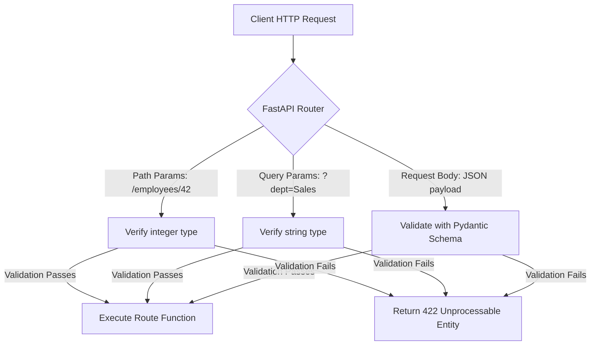

When building APIs, clients need to send data to the server. FastAPI provides clean, standard mechanisms to handle incoming data through:
* **Path Parameters**: Identifying a specific resource.
* **Query Parameters**: Filtering or sorting resources.
* **Request Bodies**: Sending complex payloads (JSON) to create or update resources.
* **Headers**: Sending metadata (like auth credentials).

---

## 1. Request Data Processing Flow

FastAPI intercepts incoming HTTP requests, extracts parameters, validates their data types using Pydantic, and feeds them directly into your Python route function.



---

## 2. Path Parameters

Path parameters are variables embedded directly inside the URL path. They are typically used to point to a specific, unique resource.

### Example: Fetching a Specific Employee
Let's add an endpoint to retrieve a single employee using their unique `employee_id`:

```python
from fastapi import FastAPI

app = FastAPI()

# Sample mock database
EMPLOYEES = {
    1: {"name": "Alice", "department": "Engineering"},
    2: {"name": "Bob", "department": "Product"}
}

@app.get("/employees/{employee_id}")
def get_employee(employee_id: int):
    # FastAPI automatically validates that 'employee_id' is an integer
    employee = EMPLOYEES.get(employee_id)
    if not employee:
        return {"error": "Employee not found"}
    return employee
```

### Key Takeaways
* **Syntax**: Define the variable in the path inside curly braces: `/employees/{employee_id}`.
* **Type Safety**: Annotate `employee_id: int` in the function arguments. If a user requests `/employees/abc`, FastAPI immediately returns a `422 Unprocessable Entity` error explaining that `employee_id` must be an integer, saving you from writing manual type-checking code!

---

## 3. Query Parameters

Any function parameter that is **not** part of the path is automatically treated as a query parameter. Query parameters appear after the `?` in the URL (e.g., `/employees?department=Product&role=Manager`).

### Example: Filtering Employees
Let's add search and filtering functionality to the employee list endpoint:

```python
@app.get("/employees")
def list_employees(department: str | None = None, limit: int = 10):
    # 'department' is optional (defaults to None)
    # 'limit' is an optional integer (defaults to 10)
    results = list(EMPLOYEES.values())
    
    if department:
        results = [emp for emp in results if emp["department"].lower() == department.lower()]
        
    return results[:limit]
```

### Key Takeaways
* **Optional parameters**: Use `str | None = None` to denote an optional query parameter.
* **Default values**: Provide a default value directly (e.g., `limit: int = 10`).

---

## 4. Request Bodies with Pydantic

When you need to send structured data to create or update a resource, you should use a **Request Body** via an HTTP `POST`, `PUT`, or `PATCH` request. You define the shape of this body using a **Pydantic Model**.

### Example: Creating (Onboarding) an Employee
First, define the schema, then declare the path operation parameter:

```python
from pydantic import BaseModel, Field

# 1. Define the Pydantic Schema
class EmployeeCreate(BaseModel):
    name: str = Field(..., min_length=2, description="First and last name of the employee")
    department: str = Field(..., description="Assigned department")
    salary: float = Field(..., gt=0, description="Monthly base salary")

@app.post("/employees")
def create_employee(employee: EmployeeCreate):
    # FastAPI automatically parses JSON body and validates against EmployeeCreate schema
    new_id = max(EMPLOYEES.keys()) + 1 if EMPLOYEES else 1
    EMPLOYEES[new_id] = employee.model_dump()
    return {"id": new_id, "data": EMPLOYEES[new_id]}
```

### Key Takeaways
* FastAPI automatically reads the body as JSON, validates it against `EmployeeCreate`, and injects it as an object named `employee` into the function.
* You can access the validation data using `.model_dump()` to get a standard Python dictionary.

---

## 5. Headers & Metadata

You can read headers sent by clients (e.g., API keys, user-agent details, system configuration metrics) using the `Header` class from FastAPI.

### Example: Reading an API Key or Client User-Agent
```python
from fastapi import Header

@app.get("/system-info")
def get_system_info(user_agent: str | None = Header(None), x_api_key: str | None = Header(None)):
    return {
        "user_agent": user_agent,
        "api_key_sent": x_api_key is not None
    }
```

> [!NOTE]
> FastAPI automatically converts snake_case arguments (like `x_api_key`) to match kebab-case headers (like `X-API-Key`) sent by the client.
