# Workshop Proposal: Advanced Python & FastAPI Web Services

**Date:** August 6, 2026

**To,**  
**The Principal / Head of Department (Computer Science & Engineering / Information Technology),**  
[Name of the College/Institution]  
[Address of the College]  

**Subject: Proposal for a 2-to-3 Day Hands-on Technical Workshop on "Advanced Python & Production-Ready FastAPI Web Services"**

---

**Dear Sir/Madam,**

I am writing to propose a comprehensive, hands-on technical workshop on **"Advanced Python & Production-Ready FastAPI Web Services"** for the pre-final and final-year students of your esteemed institution.

While academic curricula provide students with a strong foundation in basic programming concepts, there remains a significant gap between writing simple scripts and building the production-ready systems expected by the software industry. This workshop is specifically designed to bridge that gap by introducing students to modern Python development workflows, industry-standard data validation using **Pydantic**, and high-performance asynchronous API development using **FastAPI** and **SQLAlchemy 2.0**.

### Why This Workshop?
1. **Industry-Driven Stack:** FastAPI is currently one of the fastest-growing Python web frameworks, used extensively by companies like Microsoft, Netflix, and Uber for high-performance microservices.
2. **Modern Tools:** Students will move away from outdated workflows and learn to use Rust-based environment managers like **`uv`**, linters like **`Ruff`**, and interactive testing tools.
3. **End-to-End Delivery:** Students won't just learn theory; they will build, structure, database-integrate, and secure a complete REST API from scratch, uploading their final project to GitHub.

---

### Proposed Workshop Syllabus & Schedule

Below is a modular layout which can be delivered as a intensive **2-Day** or **3-Day** program (recommended):

```mermaid
gantt
    title Proposed Workshop Timeline
    dateFormat  X
    axisFormat %d
    section Day 1: Advanced Python Core
    Fundamentals & Internals : active, 0, 4
    Functions, Scope & Generators : active, 4, 8
    section Day 2: Architecture & Validation
    Advanced OOP & Decorators : 8, 12
    Pydantic Data Validation : 12, 16
    section Day 3: Web Services & Security
    FastAPI Routing & DB Integration : 16, 20
    JWT Auth & Deployment Essentials : 20, 24
```

#### Day 1: Advanced Python Core & Execution Internals
* **Session 1 (Morning): Object Internals & Mutability**
  * Variable references, CPython memory addresses (`id()`, `is` vs `==`), and integer caching.
  * Mutability pitfalls (mutable default arguments) and floating-point arithmetic nuances (`0.1 + 0.2 != 0.3`).
* **Session 2 (Afternoon): String Engineering & Function Nuances**
  * Advanced indexing, slicing, split/join mechanics, and clean string processing.
  * Scope resolution (LEGB rule, `global`, `nonlocal`), packing/unpacking operators (`*args`, `**kwargs`), and conditional expressions.
  * Functional programming: Lambdas, generator functions (`yield`), iterators, and `map`/`filter`/`zip` constructs.

#### Day 2: Advanced OOP & Pydantic Data Validation
* **Session 3 (Morning): Production-Grade Object-Oriented Programming**
  * Closures and custom decorator creation for logging and execution timing.
  * Magic methods (`__repr__`, `__call__`), properties (`@property` getters/setters), and Abstract Base Classes (ABCs).
  * Context managers (`with` statements) for resource handling.
* **Session 4 (Afternoon): Data Validation & Modeling with Pydantic**
  * Defining schemas, type coercion, and nested model validation.
  * Handling configuration files (`.env`, `pyproject.toml`) and environment variables.

#### Day 3: FastAPI Web Services & Database Integrations
* **Session 5 (Morning): Asynchronous FastAPI Development**
  * Async/Await event loop principles in Python.
  * Setting up FastAPI routes, handling Path, Query, and Request Body parameters.
  * OpenAPI/Swagger interactive documentation.
  * Asynchronous databases with **SQLAlchemy 2.0 ORM** and database migration tracking using **Alembic**.
* **Session 6 (Afternoon): API Security & Deployments**
  * Securing endpoints: Password hashing and JWT (JSON Web Token) authentication flows.
  * Structuring large FastAPI projects (Modular routing) and building a portfolio-grade CRUD API.

---

### Expected Student Outcomes
- **Practical Portfolio Project:** Every student will build and deploy a modular API with user auth and database sync, hosted in their GitHub profile.
- **Familiarity with Modern Toolchains:** Hands-on experience with `uv`, `Ruff`, `VS Code`, and Git.
- **Industry Readiness:** Practical understanding of REST principles, database migrations, and web security.

### Lab Infrastructure Requirements
To ensure a smooth, hands-on delivery, the college computer lab should have:
- Standard desktop computers (Windows, macOS, or Linux).
- Projector and sound system for the instructor.
- High-speed internet access (for package installations).
- **Software installed prior to the workshop:** VS Code, Git, and Python 3.12+.

Thank you for considering this proposal. I would be pleased to schedule a brief meeting or call with you and the faculty members to discuss dates, logistics, and customize this curriculum to align perfectly with your students' background.

Sincerely,  

**[Your Name / Your Organization]**  
[Your Designation / Title]  
[Contact Number]  
[Email Address]  
[LinkedIn Profile / Portfolio Link]  
