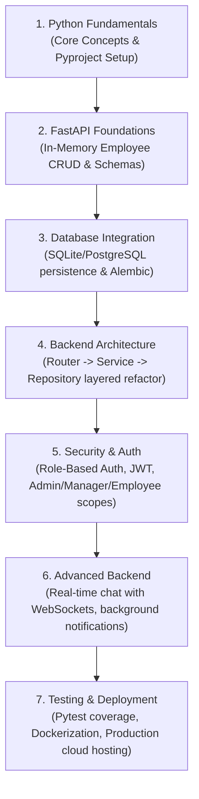

Welcome to the **FastAPI Backend Development Course Route Map**. This course is designed using a **Project-Based Learning (PBL)** approach. 

Throughout the course, you will build a single, comprehensive **Employee Management System (EMS)**. As you progress from module to module, you will continuously build upon this project, increasing its complexity and architectural robustness until it is a production-grade, secure, real-time application.

---

## 🗺️ Project Evolution Path

---

## Module 1: Python Fundamentals for Backend Development
Core Python concepts essential for building robust backend services.

### 1.1 Functions & Scope
* Functions definition & parameter syntax
* Return values & functional interfaces
* Positional vs. Keyword arguments
* Variable scope boundaries (Local, Enclosing, Global, Built-in)

### 1.2 Modules, Packages & Built-in Modules
* Creating custom module files & namespaces
* Directory package structures and `__init__.py` initializations
* Package imports & import management configurations
* Standard Library essentials: `pathlib`, `os` file systems, `datetime`, `uuid` unique identifiers, and `json` operations

### 1.3 Classes & Object-Oriented Programming
* Blueprint class definitions and dynamic instances
* Initializer constructors (`__init__`)
* Class inheritance contracts
* Encapsulation, protected fields, and property getters/setters
* Class methods (`@classmethod`) vs. Static methods (`@staticmethod`)

### 1.4 Exception Handling
* Try-except-finally validation scopes
* Raising exceptions manually
* Creating custom exception classes inheriting `Exception`

### 1.5 Asynchronous Programming
* Async & Await declarations
* Event Loop concept & task scheduling
* Concurrency vs. Parallelism and network I/O optimization

### 1.6 Type Hinting
* Basic type annotations (`str`, `int`, `float`, `bool`)
* Generic collection annotations (`list`, `dict`, `set`, `tuple`)
* Modern Union syntax (`str | None` instead of `Optional[str]`)

### 1.7 Data Validation with Pydantic
* BaseModel schema definitions
* Field constraints & metadata (`Field`)
* `@field_validator` hooks for custom validations
* Schema serialization & deserialization (`.model_dump()`, `.model_dump_json()`)

### 1.8 Environment Management
* Creating isolated virtual environments
* Package installation using `pip`
* High-performance package management with the `uv` tool
* Declarative dependency management with `pyproject.toml`

### 1.9 Organizing Project Structure
* Modular backend project layouts
* Layered package groupings
* Handling relative vs. absolute import errors

### 1.10 Environment Variables
* Storing configurations in `.env` files
* Settings management with `pydantic-settings`
* Keeping API credentials and database secrets secure

---

## Module 2: FastAPI Foundations
*Project Stage: In-Memory Employee CRUD API*

Build the foundational REST API endpoints for our Employee Management System using a local dictionary/list for state.

### 2.1 How the Web Works
* HTTP request and response structures
* Common HTTP status codes (2xx, 3xx, 4xx, 5xx)
* Semantic HTTP verbs (GET, POST, PUT, DELETE)

### 2.2 Introduction to FastAPI
* Declaring API applications
* Running hot-reloading development servers with `uvicorn`
* Basic project setups and startup scripts

### 2.3 Request Handling
* Extracting variables from URL paths (Path Parameters like `/employees/{employee_id}`)
* Parsing query arguments (Query Parameters like search, department filter)
* Validating incoming request bodies with Pydantic (`EmployeeCreate` schema)
* Reading header metadata parameters

### 2.4 Response Handling
* Controlling JSON outputs with Response Models (`EmployeeOut` schema)
* Setting semantic HTTP status codes
* Returning custom replies (plain text, file streams, redirects)

### 2.5 APIRouter & Route Versioning
* Splitting routes into modular sub-modules (`/employees`, `/departments`)
* Organizing endpoints using APIRouter namespaces
* API versioning protocols (e.g. `/v1/`, `/v2/`)

### 2.6 Dependency Injection
* Reusable dependencies with `Depends()`
* Scoping dependency execution lifecycles
* Structuring database session dependencies

### 2.7 Basic CRUD Operations
* In-memory CRUD manipulations
* Handling mock datasets inside Lists and Dictionaries

### 2.8 API Documentation
* Interactive Swagger UI documentation
* ReDoc alternative interactive views
* Exporting standard OpenAPI specifications

---

## Module 3: Database Integration
*Project Stage: Persistent SQLite/PostgreSQL Database*

Transition the Employee Management System from volatile in-memory dicts to a persistent SQL database using Object-Relational Mappers.

### 3.1 Relational Databases
* SQLite for local testing
* PostgreSQL for production databases
* SQL raw statements vs. Object-Relational Mapping (ORM)

### 3.2 SQLAlchemy ORM
* Declaring database tables using ORM mapping classes (e.g., `Employee`, `Department` tables)
* Managing operations using sessions and context managers
* Defining database relationships (One-to-Many: Department to Employees)

### 3.3 Database Migrations
* Bootstrapping migration scripts with Alembic
* Tracking schema upgrades and downgrades programmatically

### 3.4 CRUD Operations
* Database inserts, selections, updates, and deletes
* Implementing query pagination, sorting, and filter bounds

---

## Module 4: Backend Architecture & Clean Code
*Project Stage: Restructuring into Layered (Clean) Architecture*

Organize the codebase of the Employee Management System for enterprise production standards.

### 4.1 Project Architecture
* Layered Architecture patterns (Routing -> Service -> Repository)
* Standard workspace folder layouts
* Clean Code principles for backend architectures

### 4.2 Models
* Defining declarative SQLAlchemy mapping classes
* Mapping schemas to active database schemas

### 4.3 Schemas
* Input validation schemas vs. Output serialization schemas
* Structuring model serialization parameters

### 4.4 Repository Pattern
* Decoupling database queries from route layers (e.g., `EmployeeRepository`)
* Creating concrete CRUD repositories
* Designing reusable generic database repository structures

### 4.5 Service Layer
* Decoupling business rules from router and repository logics (e.g., `EmployeeService` containing logic for salary validation, onboarding workflows)
* Service composition patterns

### 4.6 Dependency Injection Scoping
* Injecting service dependencies into routers
* Injecting repository dependencies into services

### 4.7 Utility & Core Modules
* App configurations and global settings
* Global constants and helper libraries

### 4.8 Logging & Error Handling
* Standard output logging formatters
* Custom global exception handlers and middleware interceptors

---

## Module 5: Security & Authentication
*Project Stage: JWT Auth & Role-Based Access Controls (RBAC)*

Secure the EMS endpoints, defining access scopes based on roles (Admin, Manager, Employee).

### 5.1 Password Security
* Secure password hashing with salt parameters
* Hashing passwords with `bcrypt`

### 5.2 JWT Authentication
* Access Token generation
* Setting token expiration limits
* Access refresh token configurations

### 5.3 Authorization
* Integrating OAuth2 password flows
* Implementing Role-Based Access Control (RBAC) validations (e.g., only Admin/Manager can add or update employees; employees can only view profiles)

---

## Module 6: Advanced Backend Development
*Project Stage: Real-Time Chat Channels, Caching, and Background Processes*

Supercharge the EMS with real-time communications (chats/messages between employees) and asynchronous workflows.

### 6.1 Middleware
* Cross-Origin Resource Sharing (CORS) configurations
* Request logging and performance monitoring middleware
* Writing custom request-response middleware

### 6.2 Background Tasks
* Running light tasks in-process with FastAPI's `BackgroundTasks` (e.g., sending welcome emails to onboarded employees)
* Scalable background processing with Celery
* Message brokers setup using Redis

### 6.3 File Uploads
* Handling incoming multi-part file uploads (`UploadFile` for employee profile pictures)
* Serving static files securely

### 6.4 Caching
* Cache setups with Redis
* Caching route outputs (e.g., department list, company directories) to optimize latency

### 6.5 WebSockets
* Establishing persistent real-time connections
* Designing direct messaging and group chat channels for employees using WebSockets

### 6.6 Rate Limiting
* Setting request volume caps using `slowapi`

---

## Module 7: Testing & Deployment
*Project Stage: Quality Assurance, Dockerization & Production Release*

Ensure the codebase is fully tested and ready to deploy to the cloud.

### 7.1 Manual Testing
* Mocking requests using Postman
* Configuring environment variables & request variables in Postman
* Setting up automated Postman test collections

### 7.2 Automated Testing
* Setting up `pytest` workspaces
* Writing mock client tests with `TestClient` (testing routes, auth, and database operations)
* Writing end-to-end integration tests

### 7.3 Docker
* Creating multi-stage Dockerfiles for python services
* Managing app containers using Docker Compose (FastAPI app, PostgreSQL, Redis)
* Docker network structures

### 7.4 Production Deployment
* Environment-specific configuration files
* Nginx reverse proxies
* Running Uvicorn behind Gunicorn supervisors
* Deploying to Render & DigitalOcean VPS hosts
