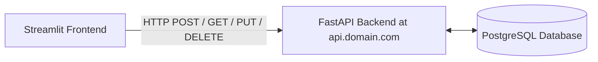

## Objectives

By the end of this module, you will be able to:

- Understand the role of Streamlit in rapid frontend prototyping.
- Connect a frontend application to a hosted FastAPI backend running at `https://api.domain.com`.
- Perform full CRUD operations (Create, Read, Update, Delete) from a GUI.
- Use the `requests` library in Python to communicate with REST APIs.
- Build interactive tables, input forms, and status notifications in Streamlit.

---

# 1. Introduction to Streamlit

**Streamlit** is an open-source Python framework that allows developers to build interactive web applications quickly, without needing to write HTML, CSS, or JavaScript. 

For backend developers, it is a powerful tool to:
* Create functional admin panels or customer portals.
* Build user interfaces to demo APIs.
* Visualize database records dynamically.

## Streamlit Fundamentals

To build effective user interfaces with Streamlit, you must understand a few core concepts:

### 1. The Execution Model
Unlike standard web frameworks that use callback events, Streamlit operates on a **top-to-bottom execution model**.
* Every time a user interacts with a widget (clicks a button, selects a dropdown, types text), Streamlit **reruns the entire Python script from top to bottom**.
* Streamlit maintains the states of input fields automatically across these reruns.

### 2. Basic UI & Display Elements
* **`st.write()`**: The "Swiss Army knife" of Streamlit. It can print text, formatted markdown, tables, or dictionaries.
* **`st.title()` / `st.header()` / `st.subheader()`**: Used to create structured text headings.
* **`st.divider()`**: Draws a clean horizontal separator line.

### 3. Input Widgets (User Actions)
Widgets allow users to pass parameters to your app:
* **`st.text_input("Label")`**: Returns the text typed by the user as a Python string.
* **`st.number_input("Label")`**: Captures numbers (with min/max constraints).
* **`st.selectbox("Label", options_list)`**: Renders a dropdown menu and returns the selected item.
* **`st.button("Click Me")`**: Returns `True` *only* during the rerun triggered by the user clicking it.

### 4. Layouts & Containers
* **`st.columns([weights])`**: Divides the screen horizontally into parallel sections.
* **`st.tabs([names])`**: Groups elements into tabs to keep the UI clean.
* **`st.form("form_name")`**: Groups input fields together so that the page doesn't rerun until the user clicks the "Submit" button inside the form.

### 5. Feedback Callouts
* **`st.success("Message")` / `st.error("Message")`**: Displays colored alert banners.
* **`st.toast("Short message")`**: Shows a brief self-dismissing pop-up toast in the corner.
* **`st.rerun()`**: Programmatically forces the app to immediately rerun from the top (useful after updating or deleting records).

---

# 2. How the Frontend Interacts with the Backend

Our frontend application is completely decoupled from the FastAPI backend. It runs as a separate process and communicates via HTTP requests:



We will use Python's popular `requests` library to trigger the endpoints of our deployed API.

---

# 3. Step-by-Step Streamlit App Code

Create a new folder named `student_frontend/` and initialize it with `uv`:

```bash
uv init student_frontend
cd student_frontend
uv add streamlit requests
```

Create a file named `app.py` in the root of the frontend project:

```python
import streamlit as st
import requests

# ---------------------------------------------------------
# Configuration
# ---------------------------------------------------------
# Replace this with your actual deployed API domain
API_BASE_URL = "https://api.domain.com"

st.set_page_config(
    page_title="Student Management System",
    page_icon="🎓",
    layout="wide"
)

st.title("🎓 Student Management Portal")
st.write("Perform CRUD operations on the student database via the cloud API.")

# ---------------------------------------------------------
# Helper Functions (API communication)
# ---------------------------------------------------------
def get_students():
    try:
        response = requests.get(f"{API_BASE_URL}/students")
        if response.status_code == 200:
            return response.json()
        st.error(f"Failed to fetch students. Status: {response.status_code}")
    except requests.exceptions.RequestException as e:
        st.error(f"Could not connect to API: {e}")
    return []

def create_student(name, email, age, grade):
    payload = {"name": name, "email": email, "age": age, "grade": grade}
    try:
        response = requests.post(f"{API_BASE_URL}/students", json=payload)
        return response.status_code == 201 or response.status_code == 200
    except requests.exceptions.RequestException as e:
        st.error(f"API Error: {e}")
    return False

def update_student(student_id, name, email, age, grade):
    payload = {"name": name, "email": email, "age": age, "grade": grade}
    try:
        response = requests.put(f"{API_BASE_URL}/students/{student_id}", json=payload)
        return response.status_code == 200
    except requests.exceptions.RequestException as e:
        st.error(f"API Error: {e}")
    return False

def delete_student(student_id):
    try:
        response = requests.delete(f"{API_BASE_URL}/students/{student_id}")
        return response.status_code == 200 or response.status_code == 204
    except requests.exceptions.RequestException as e:
        st.error(f"API Error: {e}")
    return False

# ---------------------------------------------------------
# UI Layout
# ---------------------------------------------------------
tab1, tab2, tab3 = st.tabs(["📋 View & Delete Students", "➕ Add New Student", "📝 Update Student Info"])

# Fetch the list of students for current operations
students = get_students()

# ---------------------------------------------------------
# Tab 1: Read and Delete Operations
# ---------------------------------------------------------
with tab1:
    st.header("Active Students List")
    if not students:
        st.info("No student records found.")
    else:
        # Create a table header
        cols = st.columns([1, 3, 4, 1, 1, 2])
        cols[0].bold("ID")
        cols[1].bold("Name")
        cols[2].bold("Email")
        cols[3].bold("Age")
        cols[4].bold("Grade")
        cols[5].bold("Actions")
        
        st.divider()
        
        # Display each student row with a delete button
        for student in students:
            cols = st.columns([1, 3, 4, 1, 1, 2])
            s_id = student["id"]
            cols[0].write(str(s_id))
            cols[1].write(student["name"])
            cols[2].write(student["email"])
            cols[3].write(str(student["age"]))
            cols[4].write(student["grade"])
            
            # Place a delete button next to the row
            if cols[5].button("🗑️ Delete", key=f"del_{s_id}"):
                if delete_student(s_id):
                    st.toast(f"Student #{s_id} deleted successfully!", icon="ℹ️")
                    st.rerun()
                else:
                    st.error("Failed to delete student.")

# ---------------------------------------------------------
# Tab 2: Create Operation
# ---------------------------------------------------------
with tab2:
    st.header("Enroll a New Student")
    with st.form("add_student_form", clear_on_submit=True):
        name = st.text_input("Full Name")
        email = st.text_input("Email Address")
        age = st.number_input("Age", min_value=5, max_value=100, value=18)
        grade = st.selectbox("Grade", ["A+", "A", "B", "C", "D", "F"])
        
        submit_btn = st.form_submit_button("Add Student")
        
        if submit_btn:
            if not name or not email:
                st.warning("Please fill out both Name and Email fields.")
            else:
                if create_student(name, email, age, grade):
                    st.success(f"Enrolled {name} successfully!")
                    st.rerun()
                else:
                    st.error("Failed to enroll student. Verify input values.")

# ---------------------------------------------------------
# Tab 3: Update Operation
# ---------------------------------------------------------
with tab3:
    st.header("Update Existing Record")
    if not students:
        st.info("No records available to update.")
    else:
        # Create a dropdown to select a student by ID/Name
        student_options = {f"{s['id']} - {s['name']}": s for s in students}
        selected_option = st.selectbox("Select Student to Edit", list(student_options.keys()))
        selected_student = student_options[selected_option]
        
        # Populate input fields with existing values
        with st.form("update_student_form"):
            new_name = st.text_input("Full Name", value=selected_student["name"])
            new_email = st.text_input("Email Address", value=selected_student["email"])
            new_age = st.number_input("Age", min_value=5, max_value=100, value=int(selected_student["age"]))
            
            # Find the index of the existing grade to preselect it in the selectbox
            grades_list = ["A+", "A", "B", "C", "D", "F"]
            current_grade_idx = grades_list.index(selected_student["grade"]) if selected_student["grade"] in grades_list else 0
            new_grade = st.selectbox("Grade", grades_list, index=current_grade_idx)
            
            update_btn = st.form_submit_button("Save Changes")
            
            if update_btn:
                if update_student(selected_student["id"], new_name, new_email, new_age, new_grade):
                    st.success(f"Updated student #{selected_student['id']} details.")
                    st.rerun()
                else:
                    st.error("Failed to save student details.")
```

---

# 4. Running the Frontend Locally

Start the Streamlit application using the `uv` tool runner:

```bash
uv run streamlit run app.py
```

The terminal will print out local URLs. Open your browser to:
```text
http://localhost:8501
```

Now you can interactively manage your remote cloud student database directly from this web page!

---

## Summary

You have successfully:
- Initialized a **Streamlit** project using `uv`.
- Connected Python actions directly to the cloud backend at **api.domain.com**.
- Implemented user input forms, selectable tables, and delete buttons.
- Triggered backend CRUD operations safely.
